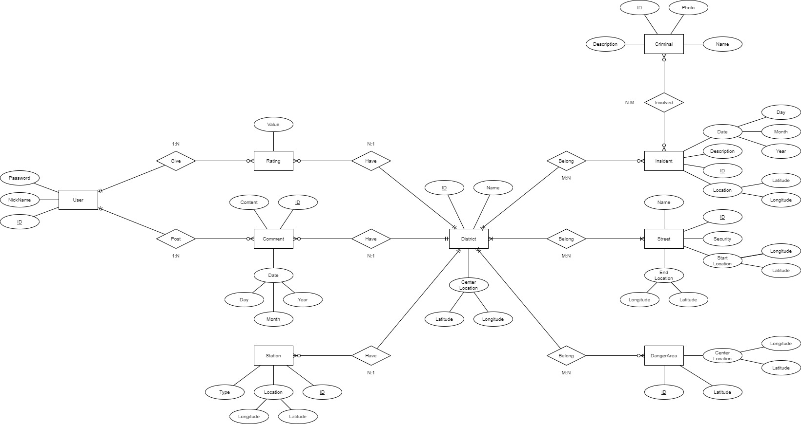
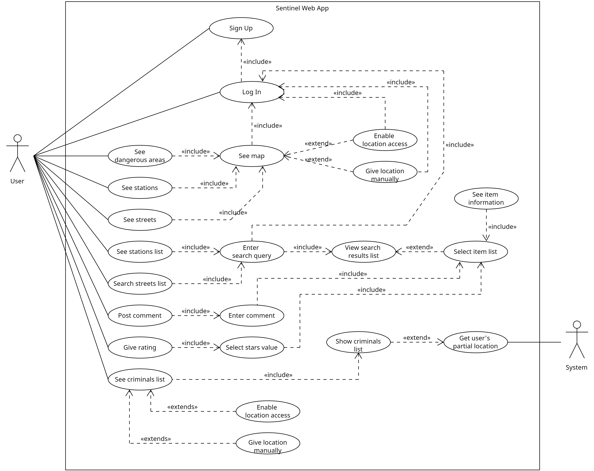
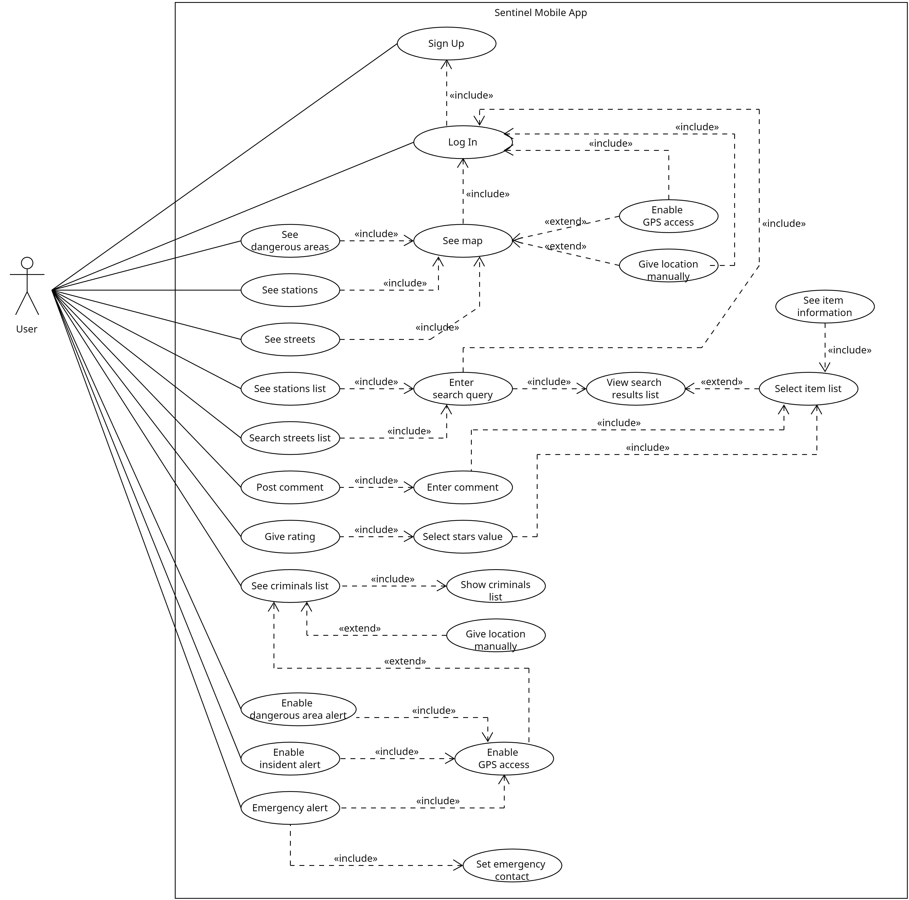

  

<h1 align="center">Sentinel</h1>
<h2 align="center">Transportation safety guide</h2>

## Content
- [Problematic](#Problematic)
- [Similar Applications](#Similar-Applications)
- [Purpose](#Purpose)
- [Features](#Features)
- [Technologies](#Technologies)

------

### Problematic
Currently in many parts of Latin America we are facing a wave of crime that is beginning to get out of control. In Ecuador, for example, the presidential candidate Fernando Villavicencio was assassinated.
In Peru, criminal gangs, made up of Venezuelans, have taken control of the streets which are almost impassable at night.
Unfortunately the police don't help much, although it's not entirely their fault.

### Similar Applications
- **Citizen:** Security application, provides real-time alerts of crimes and emergencies.
- **Nextdoor:** Social network for neighbors, also used to share information about neighborhood safety and dangerous areas.
- **Ring:** It allows users to share videos and information about safety incidents in their neighborhood.

### Purpose
Sentinel is a web application designed to improve personal and community safety. The goal is to empower users with real-time information about hazardous areas, allowing them to make informed decisions about their safety and well-being.

- **Intuitive UI:** Features an easy-to-use UI that allows users to navigate efficiently and access the information they need quickly.
- **Information precision:** Provides accurate and up-to-date information, collaborating with local authorities and using advanced technology to identify dangerous areas.
- **Privacy:** Sentinel will only have access to your location when the user wants it, and the authentication methods will also vary.
- **User Community:** Foster an active community where users can share information and help each other stay safe.

### Features
- Mapping of dangerous zones (areas).
- Comments and ratings of areas and districts.
- Real-time alerts when entering a dangerous area (mobile application).
- Real-time alerts of nearby incidents (1 kilometer away) (mobile application).
- Mapping of police stations and security posts.
- Mapping of safe and unsafe avenues and streets (they are already drawn).
- Emergency button, this will communicate with the police or emergency contacts (mobile application).
- List of wanted criminals.

### Technologies
- PostgreSQL (Supabase)
- NodeJS y ExpressJS
- React y React Native
- Bootstrap
- Google Maps Platform
- Firebase Cloud Messaging

# Documentation

## Entity–Relationship Model

  

## Case Use Diagram
### Web Application

  

### Mobile Application

  

